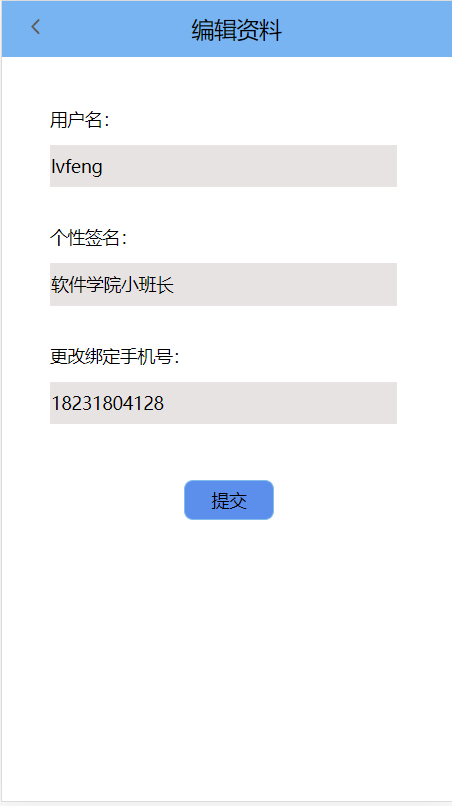

#  高校畅游通
## 项目简介
**高校畅游通**是一款集预约服务，高校旅游导航，兼职平台于一体的旅游建议APP。当下文化旅游作为一种新的旅游项目正在逐渐兴起,其中的一种形式——高校旅游也渐成社会大众青脒的旅游方式.我国高校旅游在取得一定成绩的同时,也存在一些亟待解决的问题.开发一种对于高校旅游资源进行利用，推荐，服务于一体的app，对于旅游资源整合很有意义，同时不管是独体经营还是进行出售，收益可观。
## 项目地址
GitHub:[https://github.com/LJHAAAAA/CollegeTravel](https://github.com/LJHAAAAA/CollegeTravel)
## 项目成员

* 秦晓旭
    * [https://github.com/xiaoxuqin](https://github.com/xiaoxuqin) 
* 冯邵一
    *  [https://github.com/Fengshaoyi](https://github.com/Fengshaoyi)
* 穆龙云
    * [https://github.com/mulongyun](https://github.com/mulongyun) 
* 黄天润
    * [https://github.com/7King](https://github.com/7King) 
* 柳江浩
    * [https://github.com/LJHAAAAA](https://github.com/LJHAAAAA) 
* 吴晓岛
    *  [https://github.com/Wuxiaodao](https://github.com/Wuxiaodao)
* 吕锋
    * [https://github.com/lvshufeng520](https://github.com/lvshufeng520)
## 项目截图

##### 注册登录：

##### 首页：

##### 攻略：

##### 圈子：

##### 我的：

